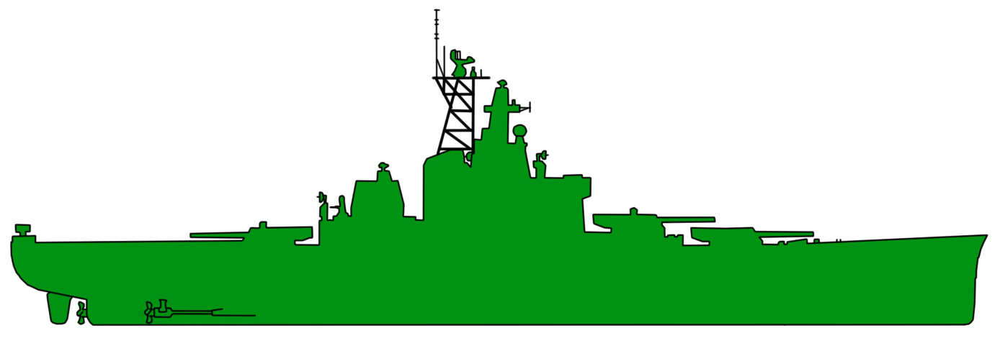
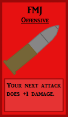
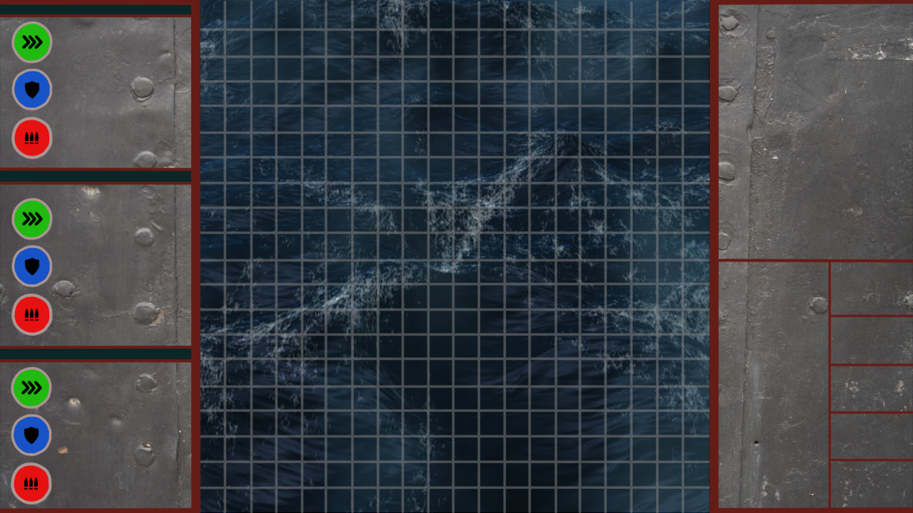

## Battleport

Pygame project made during the first year of the Computer Science programme at the Rotterdam University of Applied Sciences.

## Screenshots

<table>
    <tr>
        <td>
            
        </td>
        <td>
            
        </td>
    </tr>
</table>

<table>
    <tr>
        <td>
            
        </td>
        <td>
            
        </td>
    </tr>
</table>

## Details

The game is based on the the boardgame Battleship. The player takes command of three ships and tries to destroy the opponent, using his wits and tactical prowess.

## Usage

The game uses pygame and python for the logic. Psycopg2 is used to communicate with a PostgresSQL database.
